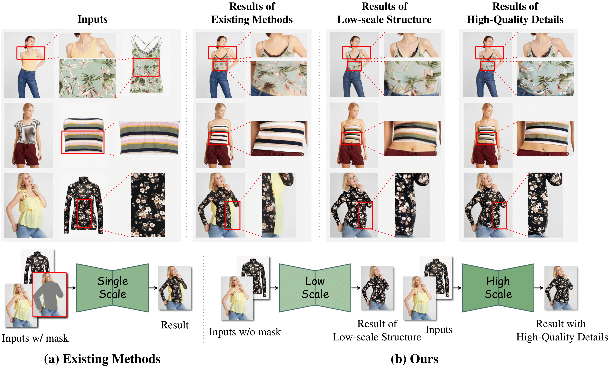

# DS-VTON: An Enhanced Dual-Scale Coarse-to-Fine Framework for Virtual Try-On

[📚 Paper](https://arxiv.org/abs/2506.00908) - [🤖 Code](https://github.com/Fu61/DS-VTON) - [🎨 Demo](https://fu61.github.io/ds-vton.github.io/)


## Overall
DS-VTON adopts an enhanced dual-scale coarse-to-fine framework combined with a mask-free strategy.
<div align="center">
  
</div>

## Abstract
Despite recent progress, most existing virtual try-on methods still struggle to simultaneously address two core challenges: accurately aligning the garment image with the target human body, and preserving fine-grained garment textures and patterns. These two requirements map directly onto a coarse-to-fine generation paradigm, where the coarse stage handles structural alignment and the fine stage recovers rich garment details. Motivated by this observation, we propose DS-VTON, an enhanced dual-scale coarse-to-fine framework that tackles the try-on problem more effectively. DS-VTON consists of two stages: the first stage generates a low-resolution try-on result to capture the semantic correspondence between garment and body, where reduced detail facilitates robust structural alignment. In the second stage, a blend-refine diffusion process reconstructs high-resolution outputs by refining the residual between scales through noise–image blending, emphasizing texture fidelity and effectively correcting fine-detail errors from the low-resolution stage. In addition, our method adopts a fully mask-free generation strategy, eliminating reliance on human parsing maps or segmentation masks. Extensive experiments show that DS-VTON not only achieves state-of-the-art performance but consistently and significantly surpasses prior methods in both structural alignment and texture fidelity across multiple standard virtual try-on benchmarks.

## Method
Upper panel: Two-scale generation pipeline. A low-resolution stage produces a coarse try-on result, then refined by a high-resolution stage; both stages share the same network architecture. Lower panel: Results with different settings; ours uses \(\sigma = 2\) and \(\alpha = \beta = \tfrac{1}{2}\). With proper two-stage settings, the second stage leverages the reliable coarse structure from the first stage to correct fine-detail errors and generate high-quality try-on results.
<div align="center">
  
</div>

## Visualization
Qualitative visual results comparison with other methods.
<div align="center">
  
</div>

## Installation
```shell
git clone https://github.com/Fu61/DS-VTON.git
cd DS-VTON
conda env create -f env.yaml
conda activate ds-vton
pip install -r requirements.txt
```
## Inference
Download the VITON-HD checkpoints from [DS-VTON](https://huggingface.co/Fufeng61/DS-VTON) and place them in the specified checkpoints/ directory.
```shell
## low-resolution result
python ./inference/low_res_infer.py --config ./configs/low_res_infer.yaml

## high-resolution result
python ./inference/high_res_infer.py --config ./configs/high_res_infer.yaml
```

## Acknowledgement
We highly reference the network architecture of the [Moore-AnimateAnyone
](https://github.com/MooreThreads/Moore-AnimateAnyone) project.

## Citation
If you find our work helpful or inspiring, please feel free to cite it.
```
@misc{sun2025dsvtonhighqualityvirtualtryon,
      title={DS-VTON: An Enhanced Dual-Scale Coarse-to-Fine Framework for Virtual Try-On}, 
      author={Xianbing Sun and Yan Hong and Jiahui Zhan and Jun Lan and Huijia Zhu and Weiqiang Wang and Liqing Zhang and Jianfu Zhang},
      year={2025},
      eprint={2506.00908},
      archivePrefix={arXiv},
      primaryClass={cs.CV},
      url={https://arxiv.org/abs/2506.00908}, 
}
```
