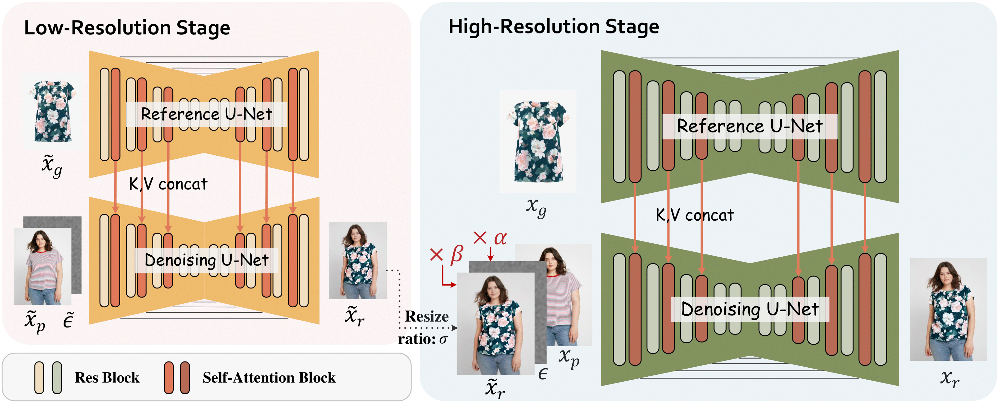

# DS-VTON: High-Quality Virtual Try-On via Disentangled Dual-Scale Generation

[📚 Paper](https://arxiv.org/abs/2506.00908) - [🤖 Code](https://github.com/Fu61/DS-VTON)

<div align="center">
  
</div>

## Abstract
Despite recent progress, most existing virtual try-on methods still struggle to simultaneously address two core challenges: accurately aligning the garment image with the target human body, and preserving fine-grained garment textures and patterns. In this paper, we propose DS-VTON, a dual-scale virtual try-on framework that explicitly disentangles these objectives for more effective modeling. DS-VTON consists of two stages: the first stage generates a low-resolution try-on result to capture the semantic correspondence between garment and body, where reduced detail facilitates robust structural alignment. The second stage introduces a residual-guided diffusion process that reconstructs high-resolution outputs by refining the residual between the two scales, focusing on texture fidelity. In addition, our method adopts a fully mask-free generation paradigm, eliminating reliance on human parsing maps or segmentation masks. By leveraging the semantic priors embedded in pretrained diffusion models, this design more effectively preserves the person's appearance and geometric consistency. Extensive experiments demonstrate that DS-VTON achieves state-of-the-art performance in both structural alignment and texture preservation across multiple standard virtual try-on benchmarks.

## Acknowledgement
The DS-VTON code is heavily based on the [Moore-AnimateAnyone
](https://github.com/MooreThreads/Moore-AnimateAnyone) project.

## Citation
If you find our work helpful or inspiring, please feel free to cite it.
```
@misc{sun2025dsvtonhighqualityvirtualtryon,
      title={DS-VTON: High-Quality Virtual Try-on via Disentangled Dual-Scale Generation}, 
      author={Xianbing Sun and Yan Hong and Jiahui Zhan and Jun Lan and Huijia Zhu and Weiqiang Wang and Liqing Zhang and Jianfu Zhang},
      year={2025},
      eprint={2506.00908},
      archivePrefix={arXiv},
      primaryClass={cs.CV},
      url={https://arxiv.org/abs/2506.00908}, 
}
```
